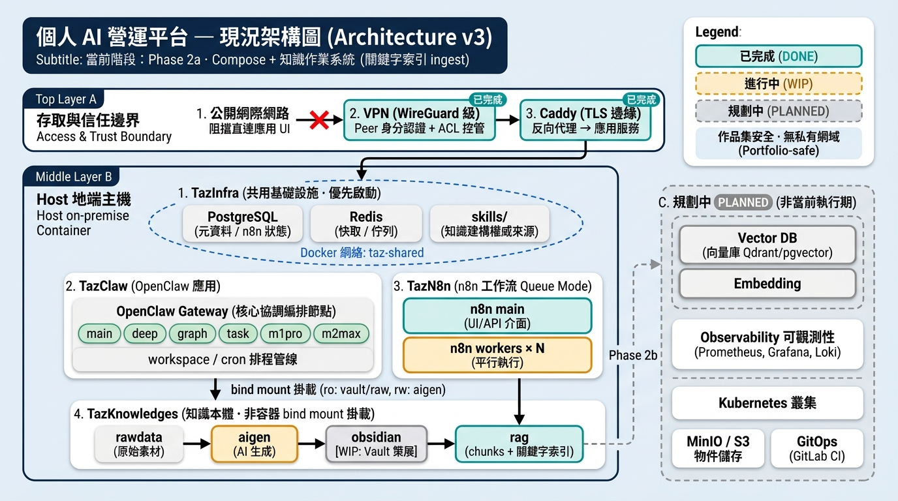
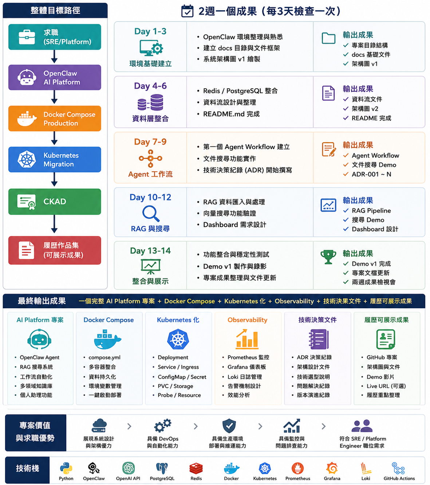

# 02 — 系統架構（System Architecture）

> **文件狀態：** v0.3 — 現況與目標分層
> **最後更新：** 2026-08-14
> **相關文件：** [01-business-goals.md](./01-business-goals.md) · [03-roadmap.md](./03-roadmap.md) · [04-knowledge-operating-system.md](./04-knowledge-operating-system.md) · [adr/0001-orchestrator-openclaw.md](./adr/0001-orchestrator-openclaw.md)

---

## 架構分層說明


| 層       | 內容                                            | 狀態             |
| ------- | --------------------------------------------- | -------------- |
| **現況**  | 三 repo：TazInfra → TazClaw／TazN8n；VPN + TLS 邊緣 | ✅ 運行中（2026-07） |
| **知識層** | TazKnowledges（PKOS 實體）→ keyword ingest → 向量 RAG | 🔄 Phase 2a／2b |
| **目標**  | Vector DB、Observability、Kubernetes、GitOps     | ⏳ Phase 2b～5   |


公開作品集不記載私人 FQDN、完整運維 runbook 或密鑰；地端細節見本機運維文件／Infra repo。

### 架構圖（v2 現況）



> **現況運行架構圖（Phase 2a · 繁中版）：** 比照 v1 視覺風格與淺色主題，呈現遠端 VPN + TLS 邊緣進入地端 Host、三 repo 拆分（TazInfra / TazClaw / TazN8n）、知識本體 bind mount（TazKnowledges）以及與 Phase 2b Planned 區塊（Vector DB、Observability、Kubernetes）的視覺隔離。

### 架構圖（v1 演進路徑）



> 資訊圖對應求職／平台演進路徑（Compose → K8s → Observability）。**實作現況**仍停在 Compose + PKOS／keyword ingest；K8s 與監控屬後續 Phase。

---

## 現況架構（運行 repo + 知識本體）

```
┌──────────────────────────────────────────────────────────────┐
│                      Host（地端）                              │
│                                                              │
│  ┌─ TazInfra（共用基礎設施，最先啟動）─────────────────────┐ │
│  │  taz-shared network · Postgres · Redis · Caddy（TLS）   │ │
│  │  NetBird 腳本（主機級 VPN，非 container）                │ │
│  │  skills/（knowledge-builder 等權威來源）                │ │
│  └─────────────────────────────────────────────────────────┘ │
│           │ 提供 network / DB / Redis / TLS / skills          │
│           ▼                                                  │
│  ┌─ TazClaw ────────────┐    ┌─ TazN8n ──────────────────┐  │
│  │  OpenClaw Gateway    │    │  n8n Queue Mode           │  │
│  │  Agents / workspace  │    │  main + workers           │  │
│  │  cron / skills       │    │  Workflow 編排與排程      │  │
│  └──────────┬───────────┘    └───────────────────────────┘  │
│             │ bind mount（ro Vault／raw；rw aigen）           │
│             ▼                                                │
│  ┌─ TazKnowledges（知識本體，非容器）──────────────────────┐ │
│  │  rawdata → aigen → obsidian → rag（chunks／keyword）   │ │
│  └─────────────────────────────────────────────────────────┘ │
└──────────────────────────────────────────────────────────────┘
```


| Repo／資產            | 擁有什麼                                                 | 不擁有什麼                                 |
| ------------------ | ---------------------------------------------------- | ------------------------------------- |
| **TazInfra**       | `taz-shared`、Postgres、Redis、Caddy、NetBird 連線腳本、共用 skills | 業務工作流、Agent prompt、n8n credentials 內容 |
| **TazClaw**        | OpenClaw gateway／cli、workspace、agent 設定、應用側 API keys | 共用 DB／Redis 實例、邊緣 TLS、VPN、知識本體目錄     |
| **TazN8n**         | n8n main + workers、本機 `n8n_data`、encryption key      | Postgres／Redis 容器本體（連 TazInfra）       |
| **TazKnowledges**  | 生命週期目錄、Obsidian Vault、kb-ID、RAG 執行期產物骨架              | Gateway／Infra 容器、公開作品集敘事              |
| **TazAIplatform**  | 公開作品集、roadmap、ADR、Demo                               | 運行時密鑰、私人網域、完整 runbook                |


### 邏輯簡圖（作品集用）

```
User / Cron / CLI
        │
        ▼
OpenClaw Gateway（TazClaw）
  Agents: main · deep · graph · task · m1pro · m2max
        │
        │  Docker network: taz-shared
        ├──────────────────┬──────────────────┐
        ▼                  ▼                  ▼
Infra（TazInfra）      n8n（TazN8n）     TazKnowledges
  Postgres · Redis       Queue Mode       Vault + rag/
  Caddy（HTTPS 邊緣）    workers × N      （bind，非網路服務）
        │
        ▼
Remote: VPN → Caddy → Gateway / n8n
```

### 啟動順序

```
1) TazInfra  up（network / DB / Redis / Caddy）
2) 主機 NetBird（遠端需要時）
3) TazClaw   up（掛載 TazKnowledges）
4) TazN8n    up --scale n8n-worker=N
```

Infra **不** `depends_on` 應用：Caddy 可先起；上游未就緒時該 site 暫不可用。

---

## 網路與信任邊界（去敏）

```
公開 Internet  ──❌──►  不承載 Control UI / n8n
        │
        │ 僅 VPN peer
        ▼
VPN（WireGuard 類）──► 邊緣 TLS（Caddy）──► taz-shared 內網
                                              │
                    ┌─────────────────────────┼─────────────────┐
                    ▼                         ▼                 ▼
             openclaw-gateway              n8n               postgres / redis
             （本機埠，不直連遠端）         （遠端走 HTTPS Host）
```


| 層                  | 含義                                                     |
| ------------------ | ------------------------------------------------------ |
| Layer 0 公開網        | 個人服務不公開解析到 VPN IP                                      |
| Layer 1 VPN        | Peer 身分 + ACL；私人 DNS                                   |
| Layer 2 Caddy      | TLS 終止；依 Host 反代                                       |
| Layer 3 taz-shared | 跨專案信任平面；不可信容器勿隨意加入                                     |
| Layer 4 應用身分       | Gateway token／裝置核准；n8n 登入 + encryption key；DB／Redis 密碼 |


**埠口原則：** 遠端唯一建議入口為邊緣 `:443`；Gateway／DB／Redis 宿主僅 `127.0.0.1` publish。

完整元件級圖與故障切分見本機 `[architecture-n8n-infra-openclaw.md](../architecture-n8n-infra-openclaw.md)`（含運維細節，不作為公開作品集正文）。

---

## 目標架構（Phase 2～5）

```
┌─────────────────────────────────────────────────────────────┐
│                     User / Cron / CLI                        │
└──────────────────────────┬──────────────────────────────────┘
                           │
┌──────────────────────────▼──────────────────────────────────┐
│                   OpenClaw (Orchestrator)                    │
│    main · deep · graph · task · m1pro · m2max（可擴充）      │
└──────────────────────────┬──────────────────────────────────┘
                           │
        ┌──────────────────┼──────────────────┐
        │                  │                  │
┌───────▼───────┐  ┌───────▼───────┐  ┌───────▼───────┐
│  PostgreSQL   │  │     Redis     │  │ Vector DB     │
│  (Metadata)   │  │  Cache/Queue  │  │ (Qdrant/TBD)  │
└───────────────┘  └───────────────┘  └───────────────┘
        │
┌───────▼───────┐  ┌───────────────┐
│  MinIO / S3   │  │  LLM APIs     │
│  (Documents)  │  │  (多模型)     │
└───────────────┘  └───────────────┘
```

---

## 技術堆疊


| 層級           | 技術                          | 用途               | 狀態              |
| ------------ | --------------------------- | ---------------- | --------------- |
| Orchestrator | OpenClaw                    | Agent 編排、工作流     | ✅               |
| Workflow 編排  | n8n Queue Mode              | 排程／整合工作流         | ✅               |
| AI           | 多模型 API（依 Agent）            | LLM 推論           | ✅               |
| 關聯式 DB       | PostgreSQL（TazInfra）        | Metadata、n8n 狀態  | ✅               |
| 快取／佇列        | Redis（TazInfra）             | n8n Bull queue 等 | ✅               |
| 邊緣           | Caddy + VPN                 | HTTPS、遠端存取       | ✅               |
| 知識資產         | TazKnowledges（Vault＋kb-ID＋keyword index） | Agent 可重用知識 | 🔄 Phase 2a |
| 向量庫          | Qdrant／pgvector（待 ADR）      | Embedding 搜尋     | ⏳ Phase 2b      |
| 物件儲存         | MinIO／S3（待 ADR）             | PDF、原始文件         | ⏳               |
| 容器化          | Docker Compose → Kubernetes | 部署               | Compose ✅／K8s ⏳ |
| 監控           | Prometheus + Grafana + Loki | Observability    | ⏳               |
| CI/CD        | GitLab CI + Runner（目標）      | GitOps           | ⏳               |


---

## 核心元件

### OpenClaw（TazClaw）

- **角色：** 平台 Orchestrator；Agent 調度與 workspace 管線
- **部署：** Docker Compose（gateway；cli profile 可選）
- **Workspace：** 任務專案與知識來源；Documents／Vault 可唯讀掛載 TazKnowledges

### n8n（TazN8n）

- **角色：** 視覺化／排程工作流；Queue Mode 執行卸載至 workers
- **依賴：** TazInfra Postgres + Redis；encryption key 在應用側

### TazKnowledges（知識本體）

- **角色：** Personal Knowledge OS 的實體儲存與治理
- **生命週期：** `rawdata` → `aigen` → `obsidian`（策展）→ `rag`（執行期索引）
- **現況：** keyword／chunk ingest 已跑；embedding／vector-db 待 Phase 2b

### 資料層


| 元件           | 職責                                | Phase       |
| ------------ | --------------------------------- | ----------- |
| PostgreSQL   | n8n 與未來 metadata；OpenClaw 可選另開 DB | ✅ Phase 1   |
| Redis        | n8n queue；快取／Session（擴充中）         | ✅ Phase 1   |
| TazKnowledges | Vault、kb-ID、chunks／keyword        | 🔄 Phase 2a |
| Vector DB    | RAG Embedding                     | ⏳ Phase 2b  |
| MinIO／S3     | PDF、圖片等原始素材                       | ⏳ Phase 2   |


### 外部整合


| 整合              | 用途                 |
| --------------- | ------------------ |
| LLM APIs        | 多模型推論              |
| FinMind／Yahoo 等 | 台股資料（workspace 專案） |
| 通知通道            | incident／摘要推送（依專案） |


---

## 資料流

### 現況（檔案管線）

```
Cron / CLI / Control UI
        │
        ▼
OpenClaw Agent → workspace projects → 產出 artifacts（日期目錄）
```

### Phase 2 知識 → RAG（現況 + 目標）

```
原始素材 (PDF / Chat export / CSV)
        │
        ▼
rawdata／inbox
        │
        ▼
knowledge-builder（staging draft）或 aigen/<agent>/
        │ 人工審閱
        ▼
obsidian/（kb-* · verified · rag-include）
        │
        ▼
rag_ingest → chunks + keyword index     ← Phase 2a（已有）
        │
        ▼
Embedding → Vector DB + Metadata        ← Phase 2b（待建）
        │
        ▼
OpenClaw Agent 檢索 → 分析／摘要／通知
```

詳見 [04-knowledge-operating-system.md](./04-knowledge-operating-system.md)。

---

## 目錄結構（本作品集 repo）

```
TazAIplatform/
├── README.md
├── HISTORY.md
├── SKILLS.md
├── assets/
│   └── architecture-v1.png              # 平台演進資訊圖
├── docs/
│   ├── 01-business-goals.md
│   ├── 02-system-architecture.md
│   ├── 03-roadmap.md
│   ├── 04-knowledge-operating-system.md
│   ├── demo-v1.md
│   ├── assets/                          # PKOS 等圖資（pkos-overview.png）
│   └── adr/
├── workflows/
│   └── knowledge-import.md
├── personal_ai_platform_architecture.md # 四層概念圖（living doc）
└── architecture-n8n-infra-openclaw.md   # 地端運維級架構（living doc）
```

應用與 Infra 的 compose 位於各自 repo，不在本公開敘事目錄內完整展開。

---

## 已知架構難點


| 問題          | 真正難點          | 緩解方向                |
| ----------- | ------------- | ------------------- |
| 成本暴增        | Token 用量      | 模型分級、快取、Prompt 優化   |
| 資料重複        | Embedding 去重  | Dedup + Metadata 設計 |
| Agent 幻覺    | Prompt 品質     | RAG Grounding、驗證步驟  |
| Workflow 混亂 | Orchestration | OpenClaw 與 n8n 權責分離 |
| 長期記憶失控      | Metadata 管理   | PostgreSQL 結構化      |
| PDF 品質差     | OCR           | 預處理 + 人工抽查；先轉 MD    |
| 新聞洗版        | Dedup         | 時間窗口 + 相似度過濾        |
| 對話當知識       | 噪音過高          | 提煉 Runbook，不整包進 RAG |


---

## Observability 架構（Phase 3 預覽）

```
OpenClaw / n8n / API
        │
        ├── Metrics → Prometheus → Grafana
        ├── Logs    → Loki       → Grafana
        └── Traces  → OTel        → Grafana
```

**Tracing 必須回答：** Request 經過哪些服務？卡在哪？Redis／MQ 是否延遲？Log 能否透過 TraceID 關聯？

---

## 架構版本紀錄


| 版本   | 日期         | 變更                                          |
| ---- | ---------- | ------------------------------------------- |
| v0.1 | 2026-06-13 | 初始架構文件，Phase 0                              |
| v0.2 | 2026-08-01 | 整併三 repo 現況、信任邊界、PKOS／RAG 資料流；與路線圖 Phase 校準 |
| v0.3 | 2026-08-14 | TazKnowledges 知識層、architecture-v1 圖資、Agents／2a 中後期資料流 |
| v0.4 | 2026-08-14 | 新增現況運行架構圖（v3 圖資 `assets/architecture-v3.png`，採用 v1 明亮視覺風格與繁中說明） |


---

## 待補項目

- [x] 現況架構（Infra + 應用拆分）
- [x] ADR-001：Orchestrator 選型（OpenClaw）
- [x] 架構圖資產（公開用 PNG，無私人網域）— `assets/architecture-v1.png` 與 `assets/architecture-v2.png`
- [ ] ADR-002：PostgreSQL 使用邊界（n8n vs OpenClaw）
- [ ] ADR-003：向量庫選型
- [ ] 資料流圖 v1（RAG Pipeline）定稿（向量段）
