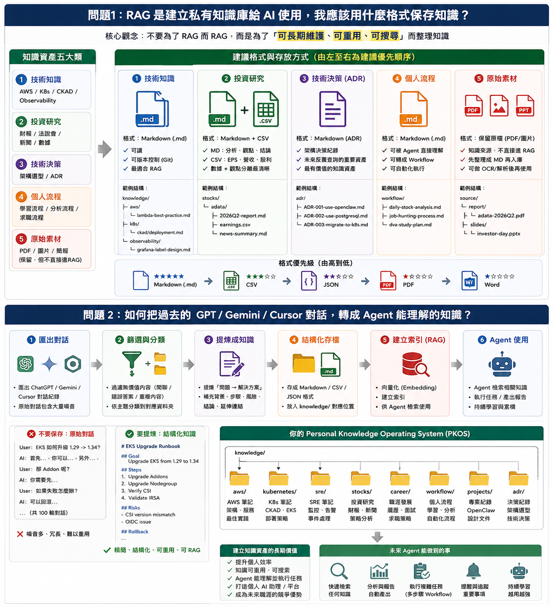

# 04 — Personal Knowledge Operating System（知識作業系統）

> **文件狀態：** Phase 2a 進行中  
> **最後更新：** 2026-08-01  
> **來源整併：** 原 `howto_AIuser_to_AIPlaform_builder/` 筆記（2026-08-01 併入本文件）；入口摘要見 [README.md](../README.md#來源與轉型脈絡ai-使用者--platform-builder)  
> **相關：** [03-roadmap.md](./03-roadmap.md) · [workflows/knowledge-import.md](../workflows/knowledge-import.md) · [SKILLS.md](../SKILLS.md)



---

## 為什麼現在寫這份文件？

這是 **AI 使用者 → AI Platform Builder** 的分水嶺：重點不再是「如何問出更好的 Prompt」，而是 **如何累積 AI 可重用資產**。

| 具體目標 | 說明 |
|----------|------|
| knowledge-builder | 完成 TazInfra Skill 配置，建立個人知識庫工作流 |
| 格式轉換 | 地端 AI 可參照檔轉成合適索引／資源格式（md、json 等） |
| 習慣 | 重要成果提煉成 Markdown，而非保存整段對話 |

路線圖位置：見 [03-roadmap.md](./03-roadmap.md) Phase 2a。

---

## Q1：RAG 友善格式——該改儲存習慣嗎？

**A：是，但不要為了 RAG 而 RAG。**

重點不是換格式本身，而是讓知識 **可讀、可版本控制、可被 Agent 重用**。

### 五類知識資產

#### 1. 技術知識（最適合 Markdown）

範例：AWS、Kubernetes、CKAD、DVA、Observability  

建議：`.md` — 可讀、可 Git、可 RAG  

```
knowledge/aws/lambda-best-practice.md
knowledge/k8s/ckad/deployment.md
knowledge/observability/grafana-label-design.md
```

#### 2. 投資研究

範例：個股、法說會、財報  

建議：Markdown + CSV  

```
knowledge/stocks/adata/
├─ 2026Q2-report.md
├─ earnings.csv
└─ news-summary.md
```

| 格式 | 適合內容 |
|------|----------|
| CSV | EPS、營收、股利 |
| Markdown | 分析、觀點、結論 |

#### 3. 技術決策（高履歷價值）

建議：ADR（Architecture Decision Record）  

本作品集已有：[`adr/0001-orchestrator-openclaw.md`](./adr/0001-orchestrator-openclaw.md)。  

長期可同步一份到 `knowledge/adr/` 供 Agent 檢索。

#### 4. 個人流程

範例：求職流程、證照學習、股票分析流程  

建議：`knowledge/workflow/*.md` — 未來 Agent 可直接讀取。

#### 5. 原始素材

範例：PDF、圖片、簡報  

原則：不要丟掉；PDF **是知識來源，不是知識庫**。  

```
resume.pdf  →  resume-summary.md  →  再進 RAG
```

### 格式優先級

| 優先級 | 格式 |
|--------|------|
| ★★★★★ | Markdown |
| ★★★★☆ | CSV |
| ★★★☆☆ | JSON |
| ★★☆☆☆ | PDF |
| ★☆☆☆☆ | Word |

**結論：** 長期第二大資產（僅次於可運轉的平台本身）是 **Markdown Knowledge Base**。

---

## Q2：過去大量 GPT／Gemini／Cursor 問答怎麼用？

**A：不要存對話，要提煉知識。**

RAG ≠ 把對話全部丟進去。Chat 裡混有問題、回答、修正、閒聊、錯誤答案——Agent 需要的是提煉後的知識。

| 錯誤 | 正確 |
|------|------|
| 保存 100 輪「EKS 升級」對話 | 提煉成一篇 Upgrade Runbook（Goal／Steps／Risks／Rollback） |

### OpenClaw 應該吃什麼？

不是 Chat History，而是 Knowledge：

```
knowledge/
├─ aws/
├─ kubernetes/
├─ sre/
├─ stocks/
├─ career/
├─ workflow/
├─ projects/
└─ adr/
```

### Agent 如何運作（目標）

任務：「請幫我分析某檔個股是否值得加碼」

1. 搜尋 `knowledge/stocks/<symbol>/*`
2. 找到歷史分析、財報、法說、持股策略
3. 再交給 LLM 綜合判斷

---

## 匯入工作流（本專案）

| 步驟 | 工具／路徑 |
|------|------------|
| Skill | `knowledge-builder`（權威：`TazInfra/skills/knowledge-builder/`，見 [SKILLS.md](../SKILLS.md)） |
| 工作流說明 | [workflows/knowledge-import.md](../workflows/knowledge-import.md) |
| 輸入 | `inbox/`（例：ChatGPT export） |
| 產出 | `staging/`（draft；審過前不寫向量庫） |
| 定庫 | 審閱通過 → `knowledge/` →（Phase 2b）Embedding |

```
Export → 過濾分類 → 提煉結構化 → staging/.md|.csv|.json
                                              │ review
                                              ▼
                                         knowledge/
                                              │ Phase 2b
                                              ▼
                                      Vector index → Agent
```

---

## 當前兩週行動（Phase 2a）

不是 Kubernetes、不是先上完整 RAG——而是：

1. **建立 `knowledge/` 目錄結構**（可先空目錄 + README）
2. **跑通 knowledge-builder**：一份真實 inbox → staging draft
3. **養成習慣**：Cursor／Chat 重要成果 → 一篇 Markdown，不存對話
4. **盤點地端素材**：列出待轉 md／json 的 AI 可參照檔清單

> **如果只能做一件事：** 從今天開始建立 `knowledge/`，並把重要成果轉成 Markdown。長期報酬率通常高於再學一個 AI Framework。

---

## 與平台其他文件的關係

| 文件 | 關係 |
|------|------|
| [01-business-goals.md](./01-business-goals.md) | 技術文件搜尋、求職、台股場景依賴本知識層 |
| [02-system-architecture.md](./02-system-architecture.md) | Phase 2 資料流接在三 repo 現況之上 |
| [03-roadmap.md](./03-roadmap.md) | Phase 2a／2b 待辦與完成標準 |
| howto 目錄 | 原始筆記與圖；**以本檔為專案內權威版本** |
